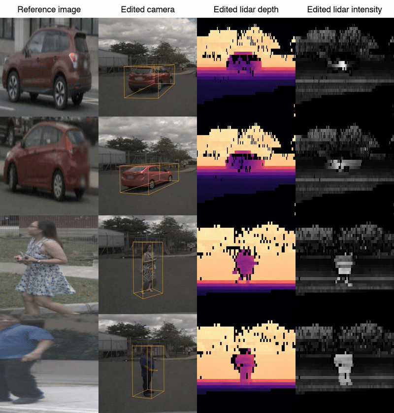
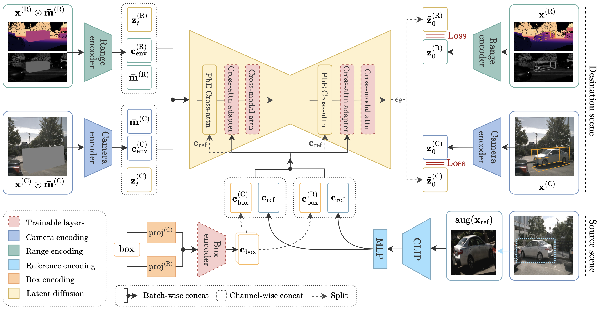

# 🐳 MObI: Multimodal Object Inpainting Using Diffusion Models

[](https://arxiv.org/abs/2501.03173)
[](https://arxiv.org/pdf/2501.03173)
[](https://agents4ad.github.io/)

Official implementation of "MObI: Multimodal Object Inpainting Using Diffusion Models" - CVPR Workshop on Data-Driven Autonomous Driving Simulation (DDADS)

<p align="center">
  
</p>

## Motivation

MObI addresses limitations in existing approaches:

1. **Object inpainting methods based on edit masks alone** (e.g., Paint-by-Example) achieve high realism but can lead to surprising results because there are often multiple semantically consistent ways to inpaint an object within a scene.

2. **Methods based on 3D reconstruction** (e.g., NeuRAD) have strong controllability but sometimes lead to low realism, especially for object viewpoints that have not been observed.

## Features

- Joint inpainting across multiple modalities (RGB camera, lidar depth and intensity)
- Object insertion using just a single reference image
- 3D bounding box conditioning for accurate spatial positioning
- Improved controllability compared to traditional inpainting methods

## Architecture

<p align="center">
  
</p>

MObI extends Paint-by-Example, a reference-based image inpainting method, to include bounding box conditioning and jointly generate camera and lidar perception inputs. Therefore, this repository is based on the [Paint-by-Example repo](https://github.com/Fantasy-Studio/Paint-by-Example).


## Installation
Clone repository and set the project root directory:
```bash
git clone https://github.com/alexbuburuzan/MObI.git
cd MObI

echo "export WORK_DIR_MOBI=$(pwd)" >> ~/.bashrc
source ~/.bashrc
```

Install conda environment based on CUDA 11.3 (you may be unable to properly install `mmdet3d` if using a different CUDA version):
```bash
conda env create -f environment.yml
conda activate mobi
```

This codebase is partly based on the [BEVFusion repo](https://github.com/mit-han-lab/bevfusion?tab=readme-ov-file), particularly the data preprocessing code. You may refer to their documentation if having issues building `mmdet3d`. Install the following:
```bash
# uses pre-build wheel; you could install from scratch
pip install mmcv-full==1.4.0 -f https://download.openmmlab.com/mmcv/dist/cu113/torch1.10.0/index.html --no-cache-dir
pip install mmdet==2.20.0
pip install nuscenes-devkit

cd bevfusion
# builds mmdet3d; use older gcc version
python setup.py develop
```

Install additional dependencies and the project itself:
```
pip install git+https://github.com/openai/CLIP.git
pip install -e git+https://github.com/CompVis/taming-transformers.git@master#egg=taming-transformers

cd WORK_DIR_MOBI
pip install -e .
```

## Data

First, download the [nuScenes dataset](https://www.nuscenes.org/nuscenes).

### nuScenes preprocessing
Run data processing script for the camera-lidar inpainting model.
```bash
bash scripts/process_data.sh
```

Expected directory structure:
```
MObI/
├── checkpoints/                         # Pretrained models
│   ├── model.ckpt                       # Paint-by-Example pretrained model
│   └── mobi_nusc_512/
│       ├── mobi_nuscenes_epoch28.ckpt   # MObI trained model
│       └── autoencoders/
│           └── range_autoencoder.ckpt   # Range view autoencoder
├── processed-data/                      # Preprocessed datasets
│   ├── nuscenes/                        # Full nuScenes dataset
│   │   ├── nuscenes_infos_train.pkl
│   │   ├── nuscenes_infos_val.pkl
│   │   ├── nuscenes_dbinfos_pbe_train.csv
│   │   ├── nuscenes_dbinfos_pbe_val.csv
│   │   ├── nuscenes_scene_infos_pbe_train.pkl
│   │   ├── nuscenes_scene_infos_pbe_val.pkl
│   │   ├── nuscenes_pbe_gt_database_train/
│   │   └── nuscenes_pbe_gt_database_val/
│   └── nuscenes-mini/                   # Mini nuScenes dataset
│       ├── ...
├── data/
│   └── nuscenes/                        # Raw nuScenes data
│       ├── samples/                     # Sensor data samples
│       ├── sweeps/                      # Sensor data sweeps
│       ├── maps/                        # Map data
│       ├── can_bus/                     # CAN bus data
│       ├── panoptic/                    # Panoptic segmentation
│       ├── v1.0-trainval/               # Train/val annotations
│       ├── v1.0-test/                   # Test annotations
│       ├── v1.0-mini/                   # Mini dataset annotations
│       ├── test_v1.0-mini/              
│       ├── nuscenes_gt_database/        
│       ├── nuscenes_infos_train_mono3d.coco.json
│       ├── nuscenes_infos_val_mono3d.coco.json
│       ├── nuscenes_map_anns_val.json
│       ├── nuScenes_license.pdf
│       ├── VERSION.txt
│       └── DISCLAIMER.txt
├── configs/                              # Configuration files
│   ├── mobi_nusc_256.yaml
│   ├── mobi_nusc_512.yaml
│   ├── mobi_nusc_all-classes_256.yaml
│   ├── mobi_nusc_all-classes_512.yaml
│   ├── mobi_nusc-mini_256.yaml
│   ├── mobi_nusc-mini_512.yaml
│   ├── pbe.yaml
│   └── range_autoencoder.yaml
├── scripts/                             # Training and evaluation scripts
├── ldm/                                 # Latent diffusion model modules
├── eval_tool/                           # Evaluation metrics (camera & lidar)
├── bevfusion/                           # BEVFusion repo
├── assets/                              # Assets and media
├── environment.yaml                     # Conda environment specification
└── main.py                              # Main training script
```

## Evaluation

Download MObI weights, including for its range view autoencoder, and Paint-by-Example:
```bash
bash scripts/download_models.sh
```

### Realism
Run the following script to perform model inference and realism evaluation given the setting described in the paper:
```bash
bash scripts/realism_test_bench.sh
```

You should obtain:
| Model | Reference Type | FID | LPIPS | CLIP | D-LPIPS | I-LPIPS |
|-------|---------------|-----|-------|------|---------|---------|
| mobi_nuscenes_epoch28 | id-ref | 6.503 | 0.114 | 84.9 | 0.130 | 0.147 |
| mobi_nuscenes_epoch28 | track-ref | 6.703 | 0.115 | 83.5 | 0.129 | 0.149 |
| mobi_nuscenes_epoch28 | in-domain-ref | 8.947 | 0.127 | 77.5 | 0.132 | 0.154 |
| mobi_nuscenes_epoch28 | cross-domain-ref | 9.046 | 0.130 | 76.0 | 0.132 | 0.153 |

### Downstream objection detection
See [bevfusion/edited-objects-eval.md](bevfusion/edited-objects-eval.md) for detailed instructions on how to run BEVFusion model on reinserted objects and measure its performance.

## Training your own model

Train MObI using Paint-by-Example pretraining and provided range view autoencoder (this codebase provides instructions on how to train your own range view VAE, too):
```
bash scripts/train.sh
```
The training script will save the top-5 checkpoints. To select the best checkpoint, run a short evaluation on each of them using the following script:
```
bash scripts/model_selection.sh
```

## Citation

If you find our work useful in your research, please consider citing:

```bibtex
@inproceedings{buburuzan2025mobi,
  title={Mobi: Multimodal object inpainting using diffusion models},
  author={Buburuzan, Alexandru and Sharma, Anuj and Redford, John and Dokania, Puneet K and Mueller, Romain},
  booktitle={Proceedings of the Computer Vision and Pattern Recognition Conference},
  pages={1974--1984},
  year={2025}
}
```

## License

[LICENSE_MObI](LICENSE_MObI) covers the MObI-specific code and assets. Please note that this codebase builds upon other works such as Paint-by-Example and BEVFusion, which have their own respective licenses.

